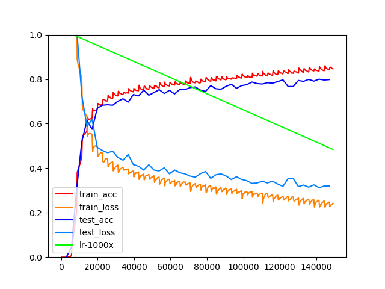

# DL-OCR-for-captcha 

# 简介
  基于mxnet的端到端OCR练习

# 进度   
* 自动生成简单的4位验证码图片 [完成]
* 训练 & 测试   
   1. 使用一个两层Conv2D的网络, 但字符准确率78%, 还在收敛,只是很慢   
   2. 使用qq的10w张的验证码数据集, 90%做训练, 10%做验证, 利用reset50做body net,
      字符准确率94%  (branch: dev-qq-captcha)
      ps:0.94是字符准确率, 因为一个验证码包括4个字符,所以算下来,验证码的准确率也只有78%左右,不过不论如何也比2层的Conv2D网络要好看很多,单纯是网络深度带来的提小恒
      

